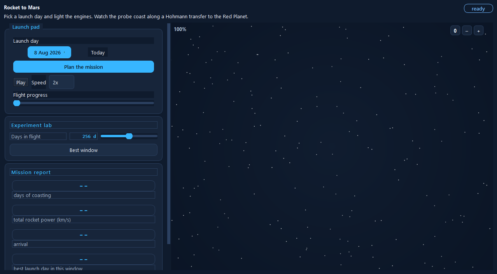
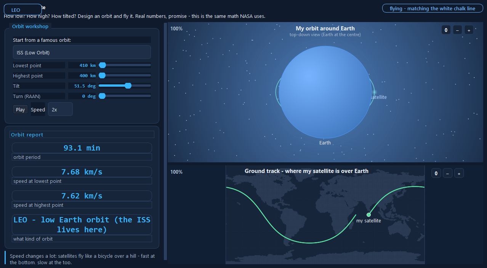
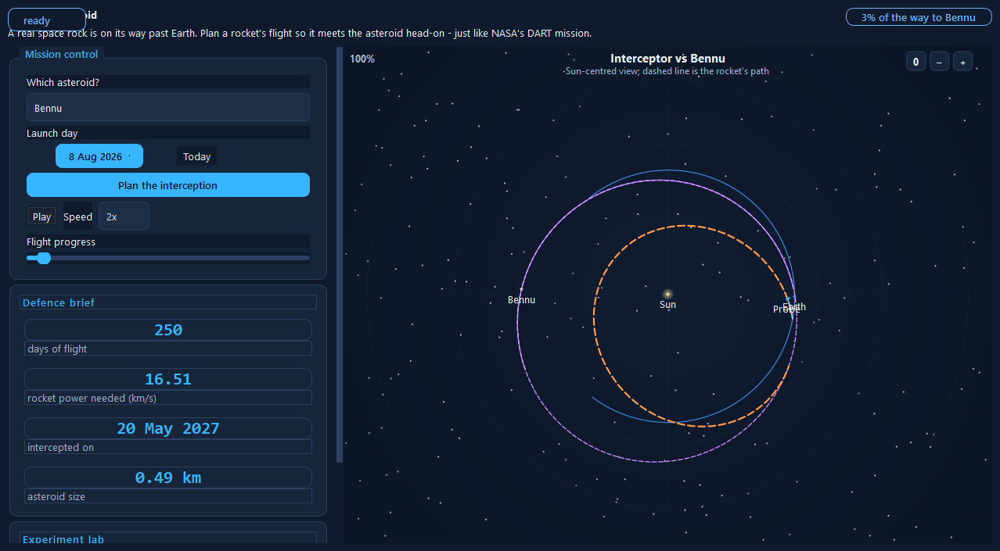
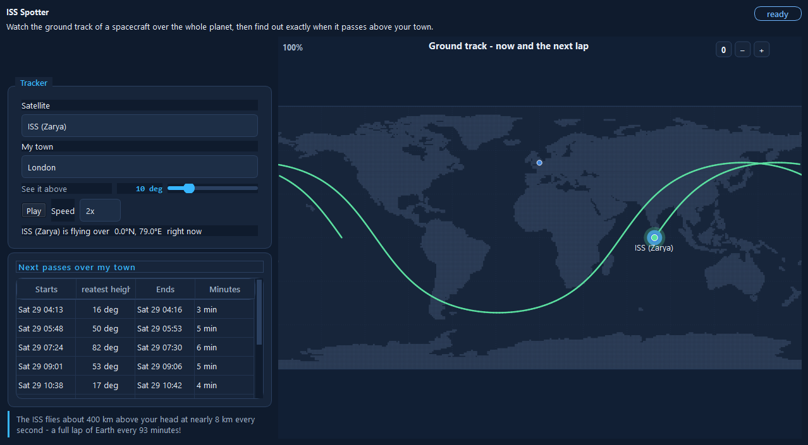
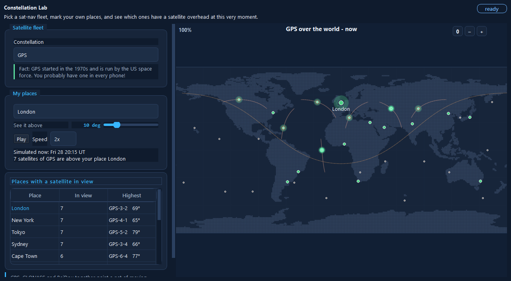
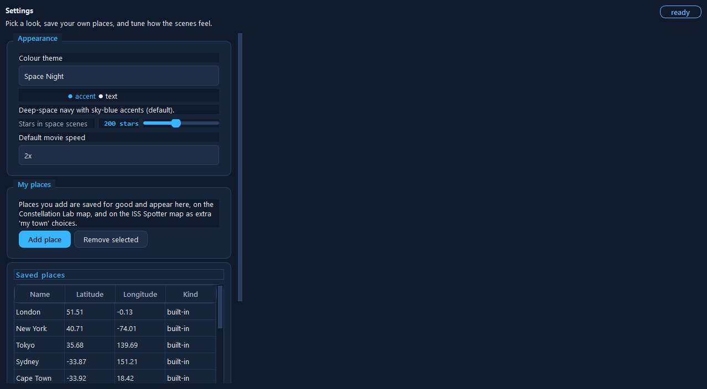

# Space Kids 🚀

A playful orbital-mechanics playground for young explorers, built on
**PySide6** and **poliastro**. Pick a launch day, fly a transfer to Mars,
intercept a real asteroid, watch the ISS pass over your town, or figure out
which GPS satellites can "see" your house right now — with real physics
underneath every frame.


---

## Screenshots

The six tabs, rendered in the default *Space Night* theme.

<table>
<tr>
  <td></td>
  <td></td>
</tr>
<tr>
  <td></td>
  <td></td>
</tr>
<tr>
  <td></td>
  <td></td>
</tr>
</table>

---

## The six activities

1. **Rocket to Mars** — plan a Hohmann-style transfer to the Red Planet. Pick a
   launch day on the calendar and watch the *launch window* come alive: some
   days the Sun and Mars are on the wrong side of the solar system and the
   trip costs a fortune in fuel. A "days in flight" experiment slider shows the
   trade-off between trip time and rocket size.
2. **Build My Satellite** — start from a famous orbit (ISS, GPS, weather
   satellites) or design your own with sliders for lowest point, highest
   point, tilt and spin. Read off a real orbit report (period, speed at
   perigee/apogee) and watch the ground track sweep across the world map.
3. **Catch the Asteroid** — chase a real near-Earth asteroid. The app
   computes a Lambert intercept from today, draws the chase in the 3-D top
   view, and lets you trade flight time for fuel with the experiment slider.
4. **ISS Spotter** — where is the space station right now? Live TLE elements
   are fetched from CelesTrak when online and propagated with proper **SGP4**;
   offline, an embedded catalog keeps working. See the ground track and a
   table of the next passes above your town (or above any place you saved).
5. **Constellation Lab** — the GPS, GLONASS and BeiDou fleets painted over the
   world. Pick a place and a horizon mask and see exactly which navigation
   satellites are high enough to give it a fix — the same job your phone does.
6. **Settings** — five click-applied colour themes (Space Night, Rainbow Kids,
   Sunny Day, Moonlight, Aurora), a persistent *My places* manager, how many
   stars the space scenes draw, and the default movie speed.

Every scene supports **wheel zoom (centred on your mouse)**, **drag to pan**,
double-click/`0`/`R` to reset, and a play bar with 1×–30× speed.

---

## Requirements

- Python **3.11+** (developed and tested on 3.13)
- `PySide6`, `poliastro`, `sgp4`, `numpy`, `astropy`, `pillow`

Internet is optional — it is only used to refresh the live ISS TLE elements.

> **Note on poliastro:** on Python 3.11+ pip resolves `poliastro 0.7.0` (the
> newest release whose metadata resolves cleanly on modern interpreters). It
> dates from 2017, so some helpers (e.g. a Hohmann convenience class) are
> re-implemented by hand in `spacekids/astro/kepler.py` and clearly marked.

---

## Install & run

```powershell
cd spacekids

python -m venv .venv
.venv\Scripts\Activate.ps1        # (Windows)  — or `.venv/bin/activate` on macOS/Linux

pip install -r requirements.txt

python main.py
```

On Linux/macOS you may also need the Qt system libraries (e.g.
`libegl1`, `libopengl0` on Debian/Ubuntu).

---

## Controls

| Control | Action |
| --- | --- |
| `Alt+1` … `Alt+6` | switch tabs |
| Mouse wheel | zoom in/out (towards the cursor) |
| `+` / `-` / `0` / `R` | zoom in / out / reset |
| Drag (left button) | pan the space scene or the world map |
| Double-click | reset zoom + pan |
| `F1` | About box |
| `F11` | toggle fullscreen |
| `Ctrl+Q` | quit |

---

## Data files

The app writes two small JSON files in `~/.spacekids/`:

| File | Contents |
| --- | --- |
| `locations.json` | the places you add in Settings (name, latitude, longitude) |
| `settings.json` | your theme, star density and default movie speed |

Both paths can be redirected with an environment variable (handy for tests and
portable installs): `SPACEKIDS_LOCATIONS` and `SPACEKIDS_SETTINGS`.

---

## Running the tests

Two suites live under `tests/` (both stdlib `unittest`, no extra deps; the GUI
tests run on Qt's `offscreen` platform and skip the network):

```powershell
# the fast dependency-light smoke suite
python tests\smoke.py

# the full edge-case suite (physics, geo, settings/theme, GUI)
python -m unittest discover -s tests -v
# or
python tests\__main__.py
```

The smoke suite is dependency-light and covers:

- Hohmann baseline + Lambert-via-poliastro consistency
- Kepler propagation vs. poliastro; planet positions and velocities
- orbit-design numbers; SGP4 parse/propagate; pass finding
- asteroid intercept; mission `plan_at_tof`
- constellation sizes, GEO-slot stability and place visibility
- locations persistence; settings persistence; theme switching
- GUI: all six pages build, replans run, map view renders

The full suite adds exhaustive edge cases across:

- **Physics** (`tests/test_astro.py`) — poliastro-on/-off branches; Kepler
  `nu↔M` round-trips, near-parabolic and hyperbolic orbits; Hohmann/Lambert
  consistency; mission plan lengths and dv trade-offs; orbit-design validity;
  asteroid intercept; GPS/GLONASS/BeiDou constellations and GEO-slot stability;
  SGP4 parse/propagate bounds; live-fetch failure paths.
- **Geo** (`tests/test_geo.py`) — sub-satellite points, elevation/ground
  distance, land-raster properties, and places add/update/remove/validation
  plus corrupt-JSON recovery.
- **Settings & theme** (`tests/test_settings_theme.py`) — persistence, reset,
  corrupt files, type filtering, palette completeness, and live switching.
- **GUI** (`tests/test_gui.py`) — every reusable widget, zoom/pan anchor
  invariants on both views, the six pages, theme persistence + restyle,
  add/remove places through the real settings UI, and spotter marker logic.

---

## Project layout

```
spacekids/
├── main.py                  # entry point: picks the saved theme, then starts the GUI
├── requirements.txt
├── LICENSE                  # MIT
└── tests/
    ├── smoke.py             # dependency-light smoke suite
    ├── helpers.py           # env isolation, offscreen app, window teardown
    ├── test_astro.py        # physics edge cases
    ├── test_geo.py          # earth / world map / places edge cases
    ├── test_settings_theme.py
    ├── test_gui.py          # widgets, views, pages, main window
    └── __main__.py          # `python tests\__main__.py` runner
└── spacekids/
    ├── __init__.py          # app meta (name, version)
    ├── app_window.py        # main window, toolbar, tabs, theme-switch restyle
    ├── controller.py        # app icon + About text
    ├── theme.py             # palette registry + runtime theme engine + global QSS
    ├── settings.py          # persisted user preferences (JSON)
    ├── widgets.py           # reusable UI: sliders, panels, play bars, date picker
    ├── pages/               # one widget per tab
    │   ├── base.py          # PageBase: header, control column + canvas splitter
    │   ├── mission_page.py  # Rocket to Mars
    │   ├── orbitlab_page.py # Build My Satellite
    │   ├── asteroid_page.py # Catch the Asteroid
    │   ├── spotter_page.py  # ISS Spotter
    │   ├── gnss_page.py     # Constellation Lab
    │   └── settings_page.py # Settings
    ├── views/spaceview.py   # top-down orbital scene painter (QPainter only)
    ├── geo/                 # Earth, maps and places
    │   ├── earth.py         # sub-satellite points, elevation, great circles
    │   ├── mapview.py       # equirectangular world map widget
    │   ├── world.py         # 1-degree land raster (embedded)
    │   └── locations.py     # shared places library (built-in + saved)
    └── astro/               # the physics
        ├── core.py          # thin poliastro facade (Orbit, Izzo Lambert, dates)
        ├── kepler.py        # pure-kepler propagation / orbit math fallback
        ├── bodies.py        # planets + Sun (mean elements)
        ├── mission.py       # Hohmann & Lambert mission planning
        ├── orbitlab.py      # orbit design + ground tracks
        ├── asteroids.py     # NEO catalog + intercept planning
        ├── constellations.py# GPS / GLONASS / BeiDou toy fleets
        └── satellites.py    # satellite catalog + live SGP4 TLE + pass finding
```

---

## How the pieces talk to each other

- **Pages** never touch `QPainter`. They describe a scene — a list of
  polylines and moving `Body` objects — and hand it to `SpaceView`, or add
  tracks/points to a `MapView`. The views own all the drawing, zooming and
  panning.
- **`theme.py` is live.** Modules read `theme.BG`, `theme.C_MARS`, … through a
  module-level attribute hook that forwards to the *active* palette. Switching
  themes in Settings re-styles the whole app instantly — the global stylesheet
  is rebuilt, inline-styled widgets re-apply, and every view repaints.
- **`astro/core.py` is the poliastro seam.** Everything else imports physics
  from `kepler`, `bodies`, `mission`, … instead of poliastro directly, so the
  pinned 2017 release can be swapped without touching the UI.
- **Rendering is deterministic.** Star fields and pseudo-random scene touches
  use a fixed seed, so screenshots and tests stay comparable.

---

## Adding a theme

1. Add a palette dict to `spacekids/theme.py` (it must contain the same colour
   keys as the others — copy `SPACE_NIGHT` and change the values).
2. Register it in `_PALETTES` with a friendly name and a one-line `_BLURBS`
   description.
3. It appears in the Settings theme picker automatically.

A light palette needs dark `TEXT`, a light `BG`/`PANEL`, and an `ACCENT` with
enough contrast for `ACCENT_TEXT`.

---

## Limitations & honesty notes

- Asteroid orbital phases are **illustrative**: the app uses textbook mean
  elements, and the intercept is a patched two-body Lambert solution, not a
  full numerical solar-system integration.
- The world map is a stylised 1-degree equirectangular land raster, used for
  ground tracks and fleet footprints — not a survey-grade projection.
- Pass times from the offline catalog are approximate; the live SGP4 TLE path
  (when online) is the accurate one.

---

## License

MIT — see `LICENSE`. Copyright (c) 2026 Amir Arshad.